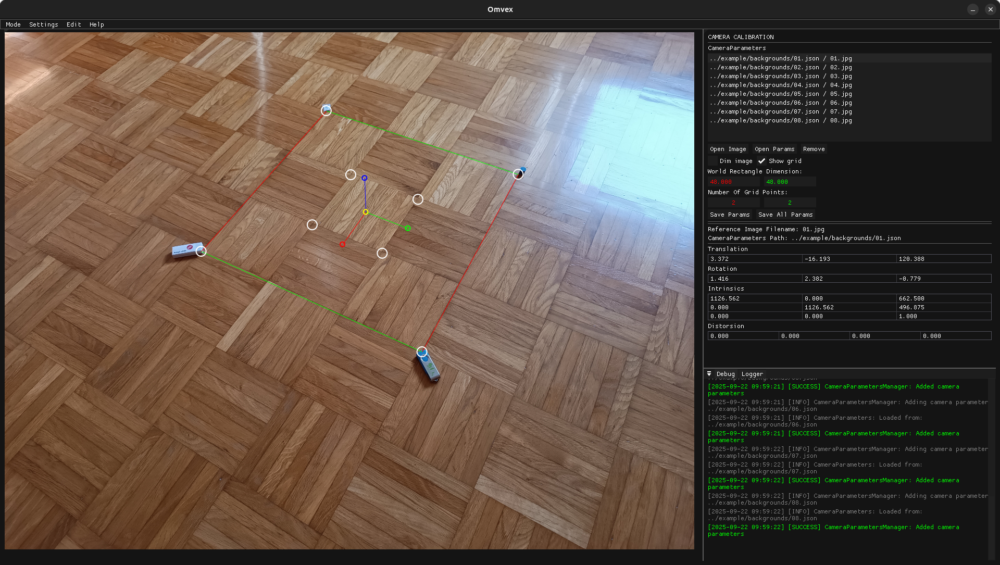
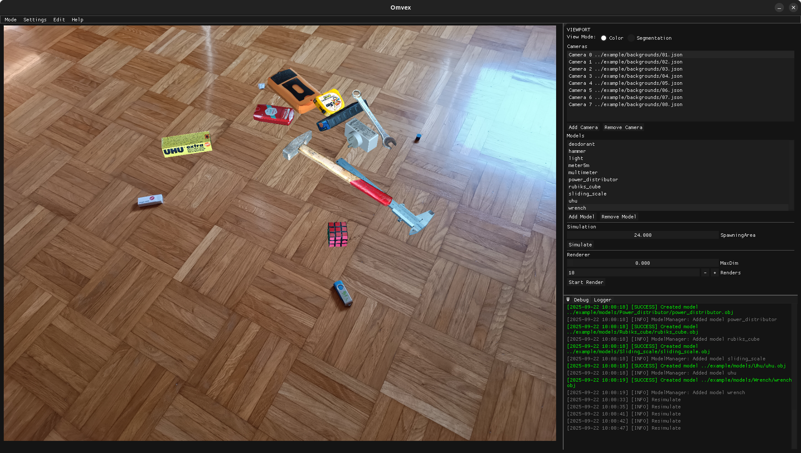
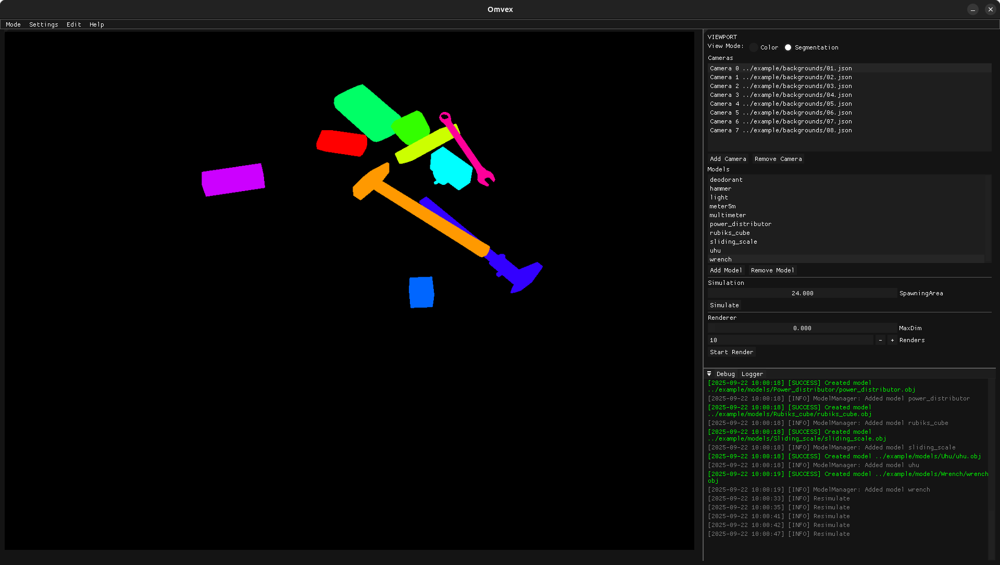

# Omvex


## Overview
Omvex is a C++ application designed to generate synthetic images using 3D models and custom backgrounds. It utilizes multiple libraries for graphics rendering, physics simulation, and file handling.

## Features
- Loads and renders 3D models
- Supports OpenGL for high-performance rendering
- Integrates physics-based simulations
- Uses OpenCV to extract camera matrix

## Dependencies
This project relies on the following libraries:

### Graphics & Rendering
- **[OpenGL](https://www.opengl.org/)** - Graphics rendering API
- **[GLFW](https://github.com/glfw/glfw)** - Window management and input handling
- **[GLM](https://github.com/g-truc/glm)** - Mathematics library for graphics programming
- **[GLAD](https://github.com/Dav1dde/glad)** - OpenGL function loader
- **[Assimp](https://github.com/assimp/assimp)** - Asset Import Library for handling 3D model files

### Physics
- **[ReactPhysics3D](https://github.com/DanielChappuis/reactphysics3d)** - Physics engine for simulating rigid body dynamics

### Image Processing
- **[OpenCV](https://opencv.org/)** - Computer vision and image processing library
- **[stb_image](https://github.com/nothings/stb)** - Single-file public domain image loader

### UI
- **[ImGui](https://github.com/ocornut/imgui)** - Immediate-mode GUI for C++

### JSON Handling
- **[nlohmann/json](https://github.com/nlohmann/json)** - JSON library for modern C++

### File Dialogs
- **[Portable File Dialogs](https://github.com/samhocevar/portable-file-dialogs)** - Cross-platform file dialog library

## Installation & Setup
### Prerequisites
Ensure you have the following installed:
- CMake (3.11 or higher)
- A C++ compiler with C++17 support
- OpenGL drivers

## Building the Project
1. Clone the repository:
   ```sh
   git clone https://github.com/tilensketa/Omvex.git
   cd Omvex
   ```
2. Build:
    - Linux (Ubuntu/Debian)
   ```sh
   ./build.sh
   ```
    - Windows
   ```sh
   build.bat
   ```
3. Run the application:
    - Linux (Ubuntu/Debian)
   ```sh
   cd build
   ./Omvex
   ```
    - Windows
   ```sh
   cd build/Release
   Omvex.exe
   ```

## Usage
- Configure camera settings
- Load 3D models and textures
- Render synthetic images

## Screenshots

### Application Preview
Camera calibration

Viewport (color, segmenatation)
<p align="center">
  
  
</p>

## Output Structure

After running Omvex, the generated data will be saved in the output folder with the following structure:

```sh
.
├── color/
├── model_names.txt
├── poses/
├── segmentation/
└── unique_colors.png
```

### Folder & File Descriptions

- **color/**  
  Contains the rendered color images of the scene.

- **segmentation/**  
  Contains segmentation images where each object is represented by a unique color.

- **model_names.txt**  
  A plain text file listing all model names in the order they appear in the scene. Useful for matching objects with segmentation colors.

- **unique_colors.png**  
  An image that maps object indices to the corresponding segmentation colors used in the `segmentation/` images.

- **poses/**  
  Contains `.json` files for each rendered scene. Each file includes:
  - Object transformations (position, rotation as quaternion)  
  - Camera matrix used for that generation

## Author
Tilen Šketa
